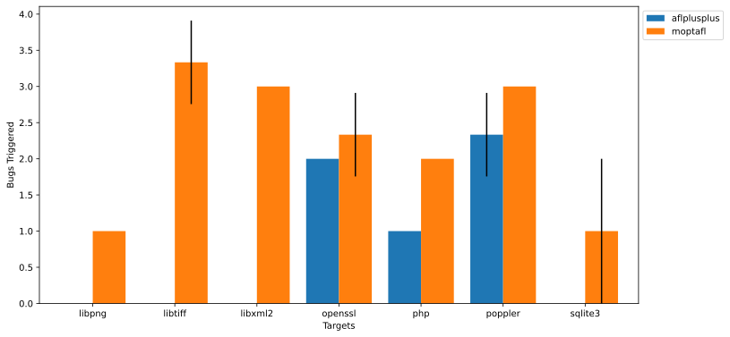
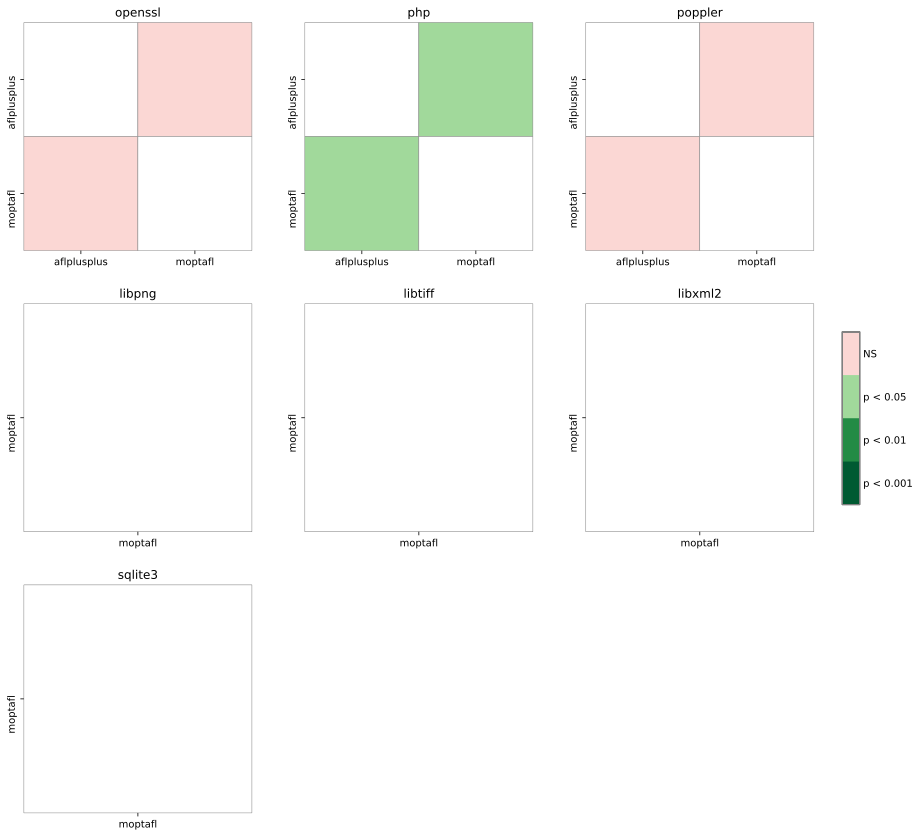



    <h1>Experiment Configuration</h1>
    <ul class="browser-default">
        <li><b>Duration</b>: 1w</li>
        <li><b>Trials</b>: 10</li>
        <li><b>Version</b>: v1.0</li>
    </ul>

    <h1>Fuzz Targets</h1>
    
This report summarizes the results of fuzzing the following targets:

    <ul id="target-list" class="browser-default">
        
        <li><a href="targets/openssl.html">openssl</a></li>
        
        <li><a href="targets/php.html">php</a></li>
        
        <li><a href="targets/poppler.html">poppler</a></li>
        
        <li><a href="targets/libpng.html">libpng</a></li>
        
        <li><a href="targets/libtiff.html">libtiff</a></li>
        
        <li><a href="targets/libxml2.html">libxml2</a></li>
        
        <li><a href="targets/sqlite3.html">sqlite3</a></li>
        
    </ul>

    <h1>Evaluated Fuzzers</h1>
    
The fuzzers used in this evaluation are listed below:

    <ul id="fuzzer-list" class="browser-default">
        
        <li><a href="fuzzers/aflplusplus.html">aflplusplus</a></li>
        
        <li><a href="fuzzers/moptafl.html">moptafl</a></li>
        
    </ul>

<!--
EXPERIMENT PARAMETERS WILL BE LISTED HERE
-->

    <h1>Experiment Summary</h1>
    

        <h2>Total Unique Bugs Triggered</h2>
        <ul class="collapsible popout">
            <li>
                

                    <h3>Mean and Standard Deviation</h3>
                

                

                    This plot shows the mean number of unique bugs triggered by every fuzzer against every target,
                    and the standard deviation bar, across all campaigns.
                

            </li>
        </ul>
        
        <ul class="collapsible popout">
            <li>
                

                    <h3>Stastistical Significance</h3>
                

                

                    This matrix summarizes the p-values of the pairwise Mann-Whitney U tests calculated against the
                    total bug count sample sets collected for every fuzzer across all campaigns. Cells with a green
                    shade indicate that the number of bugs triggered by a fuzzer is statistically different.
                

            </li>
        </ul>
        
    

    

        <h2>Mean Survival Time</h2>
        <ul class="collapsible popout">
            <li>
                

                    <h3>Ranking of Bugs and Fuzzers</h3>
                

                

                    This table shows the restricted mean survival time for every bug being reached or triggered over the
                    duration of the campaign, using the Kaplan-Meier non-parametric survival function estimator.
                    Green-shaded cells indicate the best performance (lowest time) for a bug metric across all fuzzers.
                    Yellow-shaded cells indicate the worst performance (highest time) for a bug metric across all fuzzers.
                    Red-shaded cells indicate that the bug survived being reached or triggered by the fuzzer throughout
                    the campaign duration.
                

            </li>
        </ul>
        

            <a id="btn-colormap" class="btn-small waves-effect waves-light" style="margin-bottom: 10px; color: white; font-weight: normal;">
                <i class="material-icons left">color_lens</i>
                Change Colormap
            </a>
        

        
        <link id="survival_stylesheet" rel="stylesheet" href="css/survival_hiliter.css">
        <table id="T_survival_table" ><thead>    <tr>        <th class="index_name level0" >Fuzzer</th>        <th class="col_heading level0 col0" colspan="2">moptafl</th>        <th class="col_heading level0 col2" colspan="2">aflplusplus</th>    </tr>    <tr>        <th class="index_name level1" >Metric</th>        <th class="col_heading level1 col0" >R</th>        <th class="col_heading level1 col1" >T</th>        <th class="col_heading level1 col2" >R</th>        <th class="col_heading level1 col3" >T</th>    </tr>    <tr>        <th class="index_name level0" >Bug ID</th>        <th class="blank" ></th>        <th class="blank" ></th>        <th class="blank" ></th>        <th class="blank" ></th>    </tr></thead><tbody>
                <tr>
                        <th id="T_survival_tablelevel0_row0" class="row_heading level0 row0" >MAE016</th>
                        <td id="T_survival_tablerow0_col0" class="data row0 col0" >10s</td>
                        <td id="T_survival_tablerow0_col1" class="data row0 col1" >52s</td>
                        <td id="T_survival_tablerow0_col2" class="data row0 col2" >10s</td>
                        <td id="T_survival_tablerow0_col3" class="data row0 col3" >1m</td>
            </tr>
            <tr>
                        <th id="T_survival_tablelevel0_row1" class="row_heading level0 row1" >AAH056</th>
                        <td id="T_survival_tablerow1_col0" class="data row1 col0" >15s</td>
                        <td id="T_survival_tablerow1_col1" class="data row1 col1" >2m</td>
                        <td id="T_survival_tablerow1_col2" class="data row1 col2" >15s</td>
                        <td id="T_survival_tablerow1_col3" class="data row1 col3" >1m</td>
            </tr>
            <tr>
                        <th id="T_survival_tablelevel0_row2" class="row_heading level0 row2" >JCH207</th>
                        <td id="T_survival_tablerow2_col0" class="data row2 col0" >10s</td>
                        <td id="T_survival_tablerow2_col1" class="data row2 col1" >1m</td>
                        <td id="T_survival_tablerow2_col2" class="data row2 col2" >10s</td>
                        <td id="T_survival_tablerow2_col3" class="data row2 col3" >4m</td>
            </tr>
            <tr>
                        <th id="T_survival_tablelevel0_row3" class="row_heading level0 row3" >AAH055</th>
                        <td id="T_survival_tablerow3_col0" class="data row3 col0" >15s</td>
                        <td id="T_survival_tablerow3_col1" class="data row3 col1" >4m</td>
                        <td id="T_survival_tablerow3_col2" class="data row3 col2" >15s</td>
                        <td id="T_survival_tablerow3_col3" class="data row3 col3" >13m</td>
            </tr>
            <tr>
                        <th id="T_survival_tablelevel0_row4" class="row_heading level0 row4" >AAH052</th>
                        <td id="T_survival_tablerow4_col0" class="data row4 col0" >15s</td>
                        <td id="T_survival_tablerow4_col1" class="data row4 col1" >3m</td>
                        <td id="T_survival_tablerow4_col2" class="data row4 col2" >15s</td>
                        <td id="T_survival_tablerow4_col3" class="data row4 col3" >22m</td>
            </tr>
            <tr>
                        <th id="T_survival_tablelevel0_row5" class="row_heading level0 row5" >AAH003</th>
                        <td id="T_survival_tablerow5_col0" class="data row5 col0" >10s</td>
                        <td id="T_survival_tablerow5_col1" class="data row5 col1" >15s</td>
                        <td id="T_survival_tablerow5_col2" class="data row5 col2" >1w</td>
                        <td id="T_survival_tablerow5_col3" class="data row5 col3" >1w</td>
            </tr>
            <tr>
                        <th id="T_survival_tablelevel0_row6" class="row_heading level0 row6" >AAH041</th>
                        <td id="T_survival_tablerow6_col0" class="data row6 col0" >15s</td>
                        <td id="T_survival_tablerow6_col1" class="data row6 col1" >20s</td>
                        <td id="T_survival_tablerow6_col2" class="data row6 col2" >1w</td>
                        <td id="T_survival_tablerow6_col3" class="data row6 col3" >1w</td>
            </tr>
            <tr>
                        <th id="T_survival_tablelevel0_row7" class="row_heading level0 row7" >AAH037</th>
                        <td id="T_survival_tablerow7_col0" class="data row7 col0" >10s</td>
                        <td id="T_survival_tablerow7_col1" class="data row7 col1" >20s</td>
                        <td id="T_survival_tablerow7_col2" class="data row7 col2" >1w</td>
                        <td id="T_survival_tablerow7_col3" class="data row7 col3" >1w</td>
            </tr>
            <tr>
                        <th id="T_survival_tablelevel0_row8" class="row_heading level0 row8" >AAH015</th>
                        <td id="T_survival_tablerow8_col0" class="data row8 col0" >15s</td>
                        <td id="T_survival_tablerow8_col1" class="data row8 col1" >27s</td>
                        <td id="T_survival_tablerow8_col2" class="data row8 col2" >1w</td>
                        <td id="T_survival_tablerow8_col3" class="data row8 col3" >1w</td>
            </tr>
            <tr>
                        <th id="T_survival_tablelevel0_row9" class="row_heading level0 row9" >JCH209</th>
                        <td id="T_survival_tablerow9_col0" class="data row9 col0" >14m</td>
                        <td id="T_survival_tablerow9_col1" class="data row9 col1" >14m</td>
                        <td id="T_survival_tablerow9_col2" class="data row9 col2" >1w</td>
                        <td id="T_survival_tablerow9_col3" class="data row9 col3" >1w</td>
            </tr>
            <tr>
                        <th id="T_survival_tablelevel0_row10" class="row_heading level0 row10" >AAH032</th>
                        <td id="T_survival_tablerow10_col0" class="data row10 col0" >15s</td>
                        <td id="T_survival_tablerow10_col1" class="data row10 col1" >18m</td>
                        <td id="T_survival_tablerow10_col2" class="data row10 col2" >1w</td>
                        <td id="T_survival_tablerow10_col3" class="data row10 col3" >1w</td>
            </tr>
            <tr>
                        <th id="T_survival_tablelevel0_row11" class="row_heading level0 row11" >AAH020</th>
                        <td id="T_survival_tablerow11_col0" class="data row11 col0" >10s</td>
                        <td id="T_survival_tablerow11_col1" class="data row11 col1" >21m</td>
                        <td id="T_survival_tablerow11_col2" class="data row11 col2" >1w</td>
                        <td id="T_survival_tablerow11_col3" class="data row11 col3" >1w</td>
            </tr>
            <tr>
                        <th id="T_survival_tablelevel0_row12" class="row_heading level0 row12" >AAH022</th>
                        <td id="T_survival_tablerow12_col0" class="data row12 col0" >38s</td>
                        <td id="T_survival_tablerow12_col1" class="data row12 col1" >22m</td>
                        <td id="T_survival_tablerow12_col2" class="data row12 col2" >1w</td>
                        <td id="T_survival_tablerow12_col3" class="data row12 col3" >1w</td>
            </tr>
            <tr>
                        <th id="T_survival_tablelevel0_row13" class="row_heading level0 row13" >MAE008</th>
                        <td id="T_survival_tablerow13_col0" class="data row13 col0" >15s</td>
                        <td id="T_survival_tablerow13_col1" class="data row13 col1" >2d</td>
                        <td id="T_survival_tablerow13_col2" class="data row13 col2" >15s</td>
                        <td id="T_survival_tablerow13_col3" class="data row13 col3" >1w</td>
            </tr>
            <tr>
                        <th id="T_survival_tablelevel0_row14" class="row_heading level0 row14" >JCH215</th>
                        <td id="T_survival_tablerow14_col0" class="data row14 col0" >2m</td>
                        <td id="T_survival_tablerow14_col1" class="data row14 col1" >2d</td>
                        <td id="T_survival_tablerow14_col2" class="data row14 col2" >1w</td>
                        <td id="T_survival_tablerow14_col3" class="data row14 col3" >1w</td>
            </tr>
            <tr>
                        <th id="T_survival_tablelevel0_row15" class="row_heading level0 row15" >MAE014</th>
                        <td id="T_survival_tablerow15_col0" class="data row15 col0" >15s</td>
                        <td id="T_survival_tablerow15_col1" class="data row15 col1" >4d</td>
                        <td id="T_survival_tablerow15_col2" class="data row15 col2" >15s</td>
                        <td id="T_survival_tablerow15_col3" class="data row15 col3" >1w</td>
            </tr>
            <tr>
                        <th id="T_survival_tablelevel0_row16" class="row_heading level0 row16" >JCH201</th>
                        <td id="T_survival_tablerow16_col0" class="data row16 col0" >15s</td>
                        <td id="T_survival_tablerow16_col1" class="data row16 col1" >1w</td>
                        <td id="T_survival_tablerow16_col2" class="data row16 col2" >15s</td>
                        <td id="T_survival_tablerow16_col3" class="data row16 col3" >4d</td>
            </tr>
            <tr>
                        <th id="T_survival_tablelevel0_row17" class="row_heading level0 row17" >MAE115</th>
                        <td id="T_survival_tablerow17_col0" class="data row17 col0" >15s</td>
                        <td id="T_survival_tablerow17_col1" class="data row17 col1" >4d</td>
                        <td id="T_survival_tablerow17_col2" class="data row17 col2" >15s</td>
                        <td id="T_survival_tablerow17_col3" class="data row17 col3" >1w</td>
            </tr>
            <tr>
                        <th id="T_survival_tablelevel0_row18" class="row_heading level0 row18" >JCH232</th>
                        <td id="T_survival_tablerow18_col0" class="data row18 col0" >2d</td>
                        <td id="T_survival_tablerow18_col1" class="data row18 col1" >4d</td>
                        <td id="T_survival_tablerow18_col2" class="data row18 col2" >1w</td>
                        <td id="T_survival_tablerow18_col3" class="data row18 col3" >1w</td>
            </tr>
            <tr>
                        <th id="T_survival_tablelevel0_row19" class="row_heading level0 row19" >AAH014</th>
                        <td id="T_survival_tablerow19_col0" class="data row19 col0" >4d</td>
                        <td id="T_survival_tablerow19_col1" class="data row19 col1" >4d</td>
                        <td id="T_survival_tablerow19_col2" class="data row19 col2" >1w</td>
                        <td id="T_survival_tablerow19_col3" class="data row19 col3" >1w</td>
            </tr>
            <tr>
                        <th id="T_survival_tablelevel0_row20" class="row_heading level0 row20" >AAH035</th>
                        <td id="T_survival_tablerow20_col0" class="data row20 col0" >15s</td>
                        <td id="T_survival_tablerow20_col1" class="data row20 col1" >1w</td>
                        <td id="T_survival_tablerow20_col2" class="data row20 col2" >1w</td>
                        <td id="T_survival_tablerow20_col3" class="data row20 col3" >1w</td>
            </tr>
            <tr>
                        <th id="T_survival_tablelevel0_row21" class="row_heading level0 row21" >JCH214</th>
                        <td id="T_survival_tablerow21_col0" class="data row21 col0" >32s</td>
                        <td id="T_survival_tablerow21_col1" class="data row21 col1" >1w</td>
                        <td id="T_survival_tablerow21_col2" class="data row21 col2" >1m</td>
                        <td id="T_survival_tablerow21_col3" class="data row21 col3" >1w</td>
            </tr>
            <tr>
                        <th id="T_survival_tablelevel0_row22" class="row_heading level0 row22" >AAH008</th>
                        <td id="T_survival_tablerow22_col0" class="data row22 col0" >15s</td>
                        <td id="T_survival_tablerow22_col1" class="data row22 col1" >1w</td>
                        <td id="T_survival_tablerow22_col2" class="data row22 col2" >1w</td>
                        <td id="T_survival_tablerow22_col3" class="data row22 col3" >1w</td>
            </tr>
            <tr>
                        <th id="T_survival_tablelevel0_row23" class="row_heading level0 row23" >JCH220</th>
                        <td id="T_survival_tablerow23_col0" class="data row23 col0" >6m</td>
                        <td id="T_survival_tablerow23_col1" class="data row23 col1" >1w</td>
                        <td id="T_survival_tablerow23_col2" class="data row23 col2" >1w</td>
                        <td id="T_survival_tablerow23_col3" class="data row23 col3" >1w</td>
            </tr>
            <tr>
                        <th id="T_survival_tablelevel0_row24" class="row_heading level0 row24" >JCH222</th>
                        <td id="T_survival_tablerow24_col0" class="data row24 col0" >2d</td>
                        <td id="T_survival_tablerow24_col1" class="data row24 col1" >1w</td>
                        <td id="T_survival_tablerow24_col2" class="data row24 col2" >1w</td>
                        <td id="T_survival_tablerow24_col3" class="data row24 col3" >1w</td>
            </tr>
            <tr>
                        <th id="T_survival_tablelevel0_row25" class="row_heading level0 row25" >JCH223</th>
                        <td id="T_survival_tablerow25_col0" class="data row25 col0" >21m</td>
                        <td id="T_survival_tablerow25_col1" class="data row25 col1" >1w</td>
                        <td id="T_survival_tablerow25_col2" class="data row25 col2" >1w</td>
                        <td id="T_survival_tablerow25_col3" class="data row25 col3" >1w</td>
            </tr>
            <tr>
                        <th id="T_survival_tablelevel0_row26" class="row_heading level0 row26" >JCH229</th>
                        <td id="T_survival_tablerow26_col0" class="data row26 col0" >7m</td>
                        <td id="T_survival_tablerow26_col1" class="data row26 col1" >1w</td>
                        <td id="T_survival_tablerow26_col2" class="data row26 col2" >1w</td>
                        <td id="T_survival_tablerow26_col3" class="data row26 col3" >1w</td>
            </tr>
            <tr>
                        <th id="T_survival_tablelevel0_row27" class="row_heading level0 row27" >JCH230</th>
                        <td id="T_survival_tablerow27_col0" class="data row27 col0" >5m</td>
                        <td id="T_survival_tablerow27_col1" class="data row27 col1" >1w</td>
                        <td id="T_survival_tablerow27_col2" class="data row27 col2" >1w</td>
                        <td id="T_survival_tablerow27_col3" class="data row27 col3" >1w</td>
            </tr>
            <tr>
                        <th id="T_survival_tablelevel0_row28" class="row_heading level0 row28" >JCH231</th>
                        <td id="T_survival_tablerow28_col0" class="data row28 col0" >23m</td>
                        <td id="T_survival_tablerow28_col1" class="data row28 col1" >1w</td>
                        <td id="T_survival_tablerow28_col2" class="data row28 col2" >1w</td>
                        <td id="T_survival_tablerow28_col3" class="data row28 col3" >1w</td>
            </tr>
            <tr>
                        <th id="T_survival_tablelevel0_row29" class="row_heading level0 row29" >JCH233</th>
                        <td id="T_survival_tablerow29_col0" class="data row29 col0" >6m</td>
                        <td id="T_survival_tablerow29_col1" class="data row29 col1" >1w</td>
                        <td id="T_survival_tablerow29_col2" class="data row29 col2" >1w</td>
                        <td id="T_survival_tablerow29_col3" class="data row29 col3" >1w</td>
            </tr>
            <tr>
                        <th id="T_survival_tablelevel0_row30" class="row_heading level0 row30" >MAE006</th>
                        <td id="T_survival_tablerow30_col0" class="data row30 col0" >15s</td>
                        <td id="T_survival_tablerow30_col1" class="data row30 col1" >1w</td>
                        <td id="T_survival_tablerow30_col2" class="data row30 col2" >15s</td>
                        <td id="T_survival_tablerow30_col3" class="data row30 col3" >1w</td>
            </tr>
            <tr>
                        <th id="T_survival_tablelevel0_row31" class="row_heading level0 row31" >AAH007</th>
                        <td id="T_survival_tablerow31_col0" class="data row31 col0" >15s</td>
                        <td id="T_survival_tablerow31_col1" class="data row31 col1" >1w</td>
                        <td id="T_survival_tablerow31_col2" class="data row31 col2" >1w</td>
                        <td id="T_survival_tablerow31_col3" class="data row31 col3" >1w</td>
            </tr>
            <tr>
                        <th id="T_survival_tablelevel0_row32" class="row_heading level0 row32" >AAH005</th>
                        <td id="T_survival_tablerow32_col0" class="data row32 col0" >15s</td>
                        <td id="T_survival_tablerow32_col1" class="data row32 col1" >1w</td>
                        <td id="T_survival_tablerow32_col2" class="data row32 col2" >1w</td>
                        <td id="T_survival_tablerow32_col3" class="data row32 col3" >1w</td>
            </tr>
            <tr>
                        <th id="T_survival_tablelevel0_row33" class="row_heading level0 row33" >AAH004</th>
                        <td id="T_survival_tablerow33_col0" class="data row33 col0" >15s</td>
                        <td id="T_survival_tablerow33_col1" class="data row33 col1" >1w</td>
                        <td id="T_survival_tablerow33_col2" class="data row33 col2" >1w</td>
                        <td id="T_survival_tablerow33_col3" class="data row33 col3" >1w</td>
            </tr>
            <tr>
                        <th id="T_survival_tablelevel0_row34" class="row_heading level0 row34" >MAE103</th>
                        <td id="T_survival_tablerow34_col0" class="data row34 col0" >15s</td>
                        <td id="T_survival_tablerow34_col1" class="data row34 col1" >1w</td>
                        <td id="T_survival_tablerow34_col2" class="data row34 col2" >20s</td>
                        <td id="T_survival_tablerow34_col3" class="data row34 col3" >1w</td>
            </tr>
            <tr>
                        <th id="T_survival_tablelevel0_row35" class="row_heading level0 row35" >MAE104</th>
                        <td id="T_survival_tablerow35_col0" class="data row35 col0" >15s</td>
                        <td id="T_survival_tablerow35_col1" class="data row35 col1" >1w</td>
                        <td id="T_survival_tablerow35_col2" class="data row35 col2" >15s</td>
                        <td id="T_survival_tablerow35_col3" class="data row35 col3" >1w</td>
            </tr>
            <tr>
                        <th id="T_survival_tablelevel0_row36" class="row_heading level0 row36" >MAE105</th>
                        <td id="T_survival_tablerow36_col0" class="data row36 col0" >15s</td>
                        <td id="T_survival_tablerow36_col1" class="data row36 col1" >1w</td>
                        <td id="T_survival_tablerow36_col2" class="data row36 col2" >15s</td>
                        <td id="T_survival_tablerow36_col3" class="data row36 col3" >1w</td>
            </tr>
            <tr>
                        <th id="T_survival_tablelevel0_row37" class="row_heading level0 row37" >MAE111</th>
                        <td id="T_survival_tablerow37_col0" class="data row37 col0" >15s</td>
                        <td id="T_survival_tablerow37_col1" class="data row37 col1" >1w</td>
                        <td id="T_survival_tablerow37_col2" class="data row37 col2" >15s</td>
                        <td id="T_survival_tablerow37_col3" class="data row37 col3" >1w</td>
            </tr>
            <tr>
                        <th id="T_survival_tablelevel0_row38" class="row_heading level0 row38" >MAE004</th>
                        <td id="T_survival_tablerow38_col0" class="data row38 col0" >15s</td>
                        <td id="T_survival_tablerow38_col1" class="data row38 col1" >1w</td>
                        <td id="T_survival_tablerow38_col2" class="data row38 col2" >15s</td>
                        <td id="T_survival_tablerow38_col3" class="data row38 col3" >1w</td>
            </tr>
            <tr>
                        <th id="T_survival_tablelevel0_row39" class="row_heading level0 row39" >JCH212</th>
                        <td id="T_survival_tablerow39_col0" class="data row39 col0" >15s</td>
                        <td id="T_survival_tablerow39_col1" class="data row39 col1" >1w</td>
                        <td id="T_survival_tablerow39_col2" class="data row39 col2" >15s</td>
                        <td id="T_survival_tablerow39_col3" class="data row39 col3" >1w</td>
            </tr>
            <tr>
                        <th id="T_survival_tablelevel0_row40" class="row_heading level0 row40" >JCH210</th>
                        <td id="T_survival_tablerow40_col0" class="data row40 col0" >53s</td>
                        <td id="T_survival_tablerow40_col1" class="data row40 col1" >1w</td>
                        <td id="T_survival_tablerow40_col2" class="data row40 col2" >1m</td>
                        <td id="T_survival_tablerow40_col3" class="data row40 col3" >1w</td>
            </tr>
            <tr>
                        <th id="T_survival_tablelevel0_row41" class="row_heading level0 row41" >AAH011</th>
                        <td id="T_survival_tablerow41_col0" class="data row41 col0" >15s</td>
                        <td id="T_survival_tablerow41_col1" class="data row41 col1" >1w</td>
                        <td id="T_survival_tablerow41_col2" class="data row41 col2" >1w</td>
                        <td id="T_survival_tablerow41_col3" class="data row41 col3" >1w</td>
            </tr>
            <tr>
                        <th id="T_survival_tablelevel0_row42" class="row_heading level0 row42" >AAH031</th>
                        <td id="T_survival_tablerow42_col0" class="data row42 col0" >20s</td>
                        <td id="T_survival_tablerow42_col1" class="data row42 col1" >1w</td>
                        <td id="T_survival_tablerow42_col2" class="data row42 col2" >1w</td>
                        <td id="T_survival_tablerow42_col3" class="data row42 col3" >1w</td>
            </tr>
            <tr>
                        <th id="T_survival_tablelevel0_row43" class="row_heading level0 row43" >AAH029</th>
                        <td id="T_survival_tablerow43_col0" class="data row43 col0" >15s</td>
                        <td id="T_survival_tablerow43_col1" class="data row43 col1" >1w</td>
                        <td id="T_survival_tablerow43_col2" class="data row43 col2" >1w</td>
                        <td id="T_survival_tablerow43_col3" class="data row43 col3" >1w</td>
            </tr>
            <tr>
                        <th id="T_survival_tablelevel0_row44" class="row_heading level0 row44" >AAH042</th>
                        <td id="T_survival_tablerow44_col0" class="data row44 col0" >35s</td>
                        <td id="T_survival_tablerow44_col1" class="data row44 col1" >1w</td>
                        <td id="T_survival_tablerow44_col2" class="data row44 col2" >1m</td>
                        <td id="T_survival_tablerow44_col3" class="data row44 col3" >1w</td>
            </tr>
            <tr>
                        <th id="T_survival_tablelevel0_row45" class="row_heading level0 row45" >AAH043</th>
                        <td id="T_survival_tablerow45_col0" class="data row45 col0" >40s</td>
                        <td id="T_survival_tablerow45_col1" class="data row45 col1" >1w</td>
                        <td id="T_survival_tablerow45_col2" class="data row45 col2" >1m</td>
                        <td id="T_survival_tablerow45_col3" class="data row45 col3" >1w</td>
            </tr>
            <tr>
                        <th id="T_survival_tablelevel0_row46" class="row_heading level0 row46" >AAH045</th>
                        <td id="T_survival_tablerow46_col0" class="data row46 col0" >20s</td>
                        <td id="T_survival_tablerow46_col1" class="data row46 col1" >1w</td>
                        <td id="T_survival_tablerow46_col2" class="data row46 col2" >20s</td>
                        <td id="T_survival_tablerow46_col3" class="data row46 col3" >1w</td>
            </tr>
            <tr>
                        <th id="T_survival_tablelevel0_row47" class="row_heading level0 row47" >AAH047</th>
                        <td id="T_survival_tablerow47_col0" class="data row47 col0" >40s</td>
                        <td id="T_survival_tablerow47_col1" class="data row47 col1" >1w</td>
                        <td id="T_survival_tablerow47_col2" class="data row47 col2" >1m</td>
                        <td id="T_survival_tablerow47_col3" class="data row47 col3" >1w</td>
            </tr>
            <tr>
                        <th id="T_survival_tablelevel0_row48" class="row_heading level0 row48" >AAH048</th>
                        <td id="T_survival_tablerow48_col0" class="data row48 col0" >20s</td>
                        <td id="T_survival_tablerow48_col1" class="data row48 col1" >1w</td>
                        <td id="T_survival_tablerow48_col2" class="data row48 col2" >35s</td>
                        <td id="T_survival_tablerow48_col3" class="data row48 col3" >1w</td>
            </tr>
            <tr>
                        <th id="T_survival_tablelevel0_row49" class="row_heading level0 row49" >AAH049</th>
                        <td id="T_survival_tablerow49_col0" class="data row49 col0" >15s</td>
                        <td id="T_survival_tablerow49_col1" class="data row49 col1" >1w</td>
                        <td id="T_survival_tablerow49_col2" class="data row49 col2" >15s</td>
                        <td id="T_survival_tablerow49_col3" class="data row49 col3" >1w</td>
            </tr>
            <tr>
                        <th id="T_survival_tablelevel0_row50" class="row_heading level0 row50" >AAH050</th>
                        <td id="T_survival_tablerow50_col0" class="data row50 col0" >25s</td>
                        <td id="T_survival_tablerow50_col1" class="data row50 col1" >1w</td>
                        <td id="T_survival_tablerow50_col2" class="data row50 col2" >30s</td>
                        <td id="T_survival_tablerow50_col3" class="data row50 col3" >1w</td>
            </tr>
            <tr>
                        <th id="T_survival_tablelevel0_row51" class="row_heading level0 row51" >AAH051</th>
                        <td id="T_survival_tablerow51_col0" class="data row51 col0" >25s</td>
                        <td id="T_survival_tablerow51_col1" class="data row51 col1" >1w</td>
                        <td id="T_survival_tablerow51_col2" class="data row51 col2" >45s</td>
                        <td id="T_survival_tablerow51_col3" class="data row51 col3" >1w</td>
            </tr>
            <tr>
                        <th id="T_survival_tablelevel0_row52" class="row_heading level0 row52" >AAH026</th>
                        <td id="T_survival_tablerow52_col0" class="data row52 col0" >15s</td>
                        <td id="T_survival_tablerow52_col1" class="data row52 col1" >1w</td>
                        <td id="T_survival_tablerow52_col2" class="data row52 col2" >1w</td>
                        <td id="T_survival_tablerow52_col3" class="data row52 col3" >1w</td>
            </tr>
            <tr>
                        <th id="T_survival_tablelevel0_row53" class="row_heading level0 row53" >AAH054</th>
                        <td id="T_survival_tablerow53_col0" class="data row53 col0" >10s</td>
                        <td id="T_survival_tablerow53_col1" class="data row53 col1" >1w</td>
                        <td id="T_survival_tablerow53_col2" class="data row53 col2" >10s</td>
                        <td id="T_survival_tablerow53_col3" class="data row53 col3" >1w</td>
            </tr>
            <tr>
                        <th id="T_survival_tablelevel0_row54" class="row_heading level0 row54" >MAE114</th>
                        <td id="T_survival_tablerow54_col0" class="data row54 col0" >15s</td>
                        <td id="T_survival_tablerow54_col1" class="data row54 col1" >1w</td>
                        <td id="T_survival_tablerow54_col2" class="data row54 col2" >15s</td>
                        <td id="T_survival_tablerow54_col3" class="data row54 col3" >1w</td>
            </tr>
            <tr>
                        <th id="T_survival_tablelevel0_row55" class="row_heading level0 row55" >AAH024</th>
                        <td id="T_survival_tablerow55_col0" class="data row55 col0" >15s</td>
                        <td id="T_survival_tablerow55_col1" class="data row55 col1" >1w</td>
                        <td id="T_survival_tablerow55_col2" class="data row55 col2" >1w</td>
                        <td id="T_survival_tablerow55_col3" class="data row55 col3" >1w</td>
            </tr>
            <tr>
                        <th id="T_survival_tablelevel0_row56" class="row_heading level0 row56" >AAH057</th>
                        <td id="T_survival_tablerow56_col0" class="data row56 col0" >15s</td>
                        <td id="T_survival_tablerow56_col1" class="data row56 col1" >1w</td>
                        <td id="T_survival_tablerow56_col2" class="data row56 col2" >15s</td>
                        <td id="T_survival_tablerow56_col3" class="data row56 col3" >1w</td>
            </tr>
            <tr>
                        <th id="T_survival_tablelevel0_row57" class="row_heading level0 row57" >AAH059</th>
                        <td id="T_survival_tablerow57_col0" class="data row57 col0" >15s</td>
                        <td id="T_survival_tablerow57_col1" class="data row57 col1" >1w</td>
                        <td id="T_survival_tablerow57_col2" class="data row57 col2" >15s</td>
                        <td id="T_survival_tablerow57_col3" class="data row57 col3" >1w</td>
            </tr>
            <tr>
                        <th id="T_survival_tablelevel0_row58" class="row_heading level0 row58" >AAH018</th>
                        <td id="T_survival_tablerow58_col0" class="data row58 col0" >22m</td>
                        <td id="T_survival_tablerow58_col1" class="data row58 col1" >1w</td>
                        <td id="T_survival_tablerow58_col2" class="data row58 col2" >1w</td>
                        <td id="T_survival_tablerow58_col3" class="data row58 col3" >1w</td>
            </tr>
            <tr>
                        <th id="T_survival_tablelevel0_row59" class="row_heading level0 row59" >JCH202</th>
                        <td id="T_survival_tablerow59_col0" class="data row59 col0" >15s</td>
                        <td id="T_survival_tablerow59_col1" class="data row59 col1" >1w</td>
                        <td id="T_survival_tablerow59_col2" class="data row59 col2" >15s</td>
                        <td id="T_survival_tablerow59_col3" class="data row59 col3" >1w</td>
            </tr>
            <tr>
                        <th id="T_survival_tablelevel0_row60" class="row_heading level0 row60" >JCH204</th>
                        <td id="T_survival_tablerow60_col0" class="data row60 col0" >25s</td>
                        <td id="T_survival_tablerow60_col1" class="data row60 col1" >1w</td>
                        <td id="T_survival_tablerow60_col2" class="data row60 col2" >47s</td>
                        <td id="T_survival_tablerow60_col3" class="data row60 col3" >1w</td>
            </tr>
            <tr>
                        <th id="T_survival_tablelevel0_row61" class="row_heading level0 row61" >AAH034</th>
                        <td id="T_survival_tablerow61_col0" class="data row61 col0" >15s</td>
                        <td id="T_survival_tablerow61_col1" class="data row61 col1" >1w</td>
                        <td id="T_survival_tablerow61_col2" class="data row61 col2" >1w</td>
                        <td id="T_survival_tablerow61_col3" class="data row61 col3" >1w</td>
            </tr>
            <tr>
                        <th id="T_survival_tablelevel0_row62" class="row_heading level0 row62" >AAH001</th>
                        <td id="T_survival_tablerow62_col0" class="data row62 col0" >15s</td>
                        <td id="T_survival_tablerow62_col1" class="data row62 col1" >1w</td>
                        <td id="T_survival_tablerow62_col2" class="data row62 col2" >1w</td>
                        <td id="T_survival_tablerow62_col3" class="data row62 col3" >1w</td>
            </tr>
    </tbody></table>
    


{{ template | replace: '    ', ''}}
